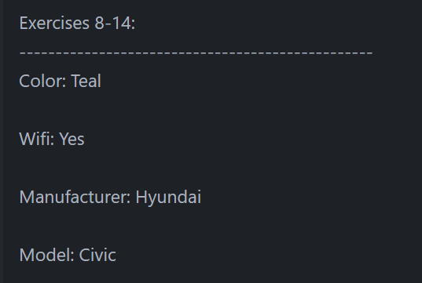

# WHAT I LEARNT

This simple project is showing my practice on Python functions, and specifically Positional and Arbitrary parameters/arguments.  
This is my first hands-on experience with these concepts. 

---

## Positional & Arbitrary Parameters/Arguments

Now I know what were all these `*args`  I was seeing in all these code examples. Essentially acting as a muliple slots placeholder `*args` definitely saves coding space.  
The more I learn the more I understand why Python is better in terms of code density. 

The hierarchy that Python applies to arguments called in a function is straightforward.  
However, I learnt that when passing a function argument in a function call (meaning as a parameter, when defining it), that **function argument HAS to be last**, as you can see here with `order_number` in my code line 26 in exercise_8_12.py: 

Luckily I tried that a little later after the error message in my output. So it didn't take long. 

---

## Arbitrary Keyword Parameters/Arguments

Arbitrary Keyword Parameters/Arguments are trickier. The use of a keyword parameter in the fist place is to add readability by being more specific in the naming of each corresponding keyword argument being called. 

Using an Arbitrary keyword is tricky because now one parameter is 'categorizing' every argument it will be calling. On the other hand, the added flexibility to call any number of arguments on the fly is to be considered too. 

--- 

## For loop with a dictionary

Looping through a dictionary is very useful when we want to print part of or the whole dictionary for reading convenience.  

The syntax, though, is not your usual "for loop" syntax. Here's what I used in the exercise_8_14.py: `for key, value in car_1.items():`.  
The important parts are: **'key, value'**, that **HAVE to be written as is**. And the** `.items()` method**. I forgot to use it in my first go, despite the AI assistant giving it to me. 

--- 

## A Little Extra

I went a little extra mile too for the exercises 8-12 and 8-14.

### For 8-12:  

The instructions were to print out the tuple created by the called function `ordering_sandw(*wanted_items, order_number)`.  
It **wasn't requested to add an order number, but I did it**. For that I just defined a function that adds 1 to an integer type argument (line 19 in exercise_8_12.py):  

And I used it in the function `ordering_sandw` on line 28. **Both functions have a common parameter: `order_number`**. It took me about an hour to find it on my own, so I'm a little proud of that.   

I was a little **too ambitious** in the first place, because I wanted it to increment that number directly in the same single function, **I didn't think to make it 2 separate functions.  **
The book do recommend to keep each function as a one-tasker, making it exclusively do a single thing. And **ultimately that is what I did** and as a consequence the code is a lot less complicated (or less 'stained' with comments) and also less obscure. 

But I also **could not achieve one thing**: to make the function increment the number without me incrementing it myself by just calling it in the function call (that common parameter that both functions have: `order_number`).   
That'll be something to keep my eye on. 

Here's the print out:  

### For 8-14:  

Some of the `**kwargs` that I had to pass to the function **were to have a boolean value.  **
And again, because I wanted to output a better nicer text I made it so that any boolean **value of True becomes a 'Yes' string**. A simple if statement did the trick (line 31 in exercise_8_14.py).  

Here's the print out: 

--- 

## How Well Did I do?

After I compared my code to the solutions: 
- **exercise 8-12**:  
  The **solution code is more mature**, if you remove my incremented order number function part. Because then it is actually just a printing-arguments function, which respects the instructions of the exercise.  
  The **`for loop` used in the solutions and the use of the prints are also better**, the output looks better. So I'll definitely reuse these tricks.  

  GRADE: I'd say pass but without style. 

- **exercise 8-13**:  
  This one was just a reuse of code already available. So no solutions for that one. 

- **exercise 8-14**:
  So in this one, my code is better because the solution code doesn't nicely structure the print.  
  And also, I added a boolean True value conversion to a string, so the print reads a little extra better too (a 'Yes' for wifi is clearer than a 'True'. Not all of us "car buyers" are developers). 

  BUT, **my mistake was to not nest the `for loop` **used for printing out the dictionary in the function itself.  
  This has consequences when we have a project folder structure with imports like it is here in the main.py file. If the function is imported it won't do the not-nested part. 

  GRADE: for this one I suppose I **barely passed, if not barely failed...** depends on critical my mistake was... 

---

#### Resources:
Python Crash Course 3rd Ed.: [solutions to exercises 8-12 to 8-14](https://ehmatthes.github.io/pcc_3e/solutions/chapter_8/#8-12-sandwiches)  

